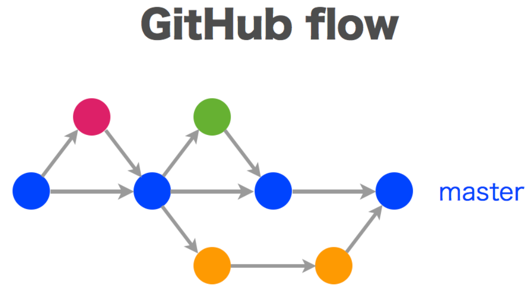

# 브랜치 전략
## Github Flow



##### Github Flow는 간단하고 직관적인 브랜치 전략으로, 다음과 같은 단계를 포함:  
1. **메인 브랜치(Main Branch)**: `main` 브랜치는 항상 배포 가능한 상태를 유지. 모든 새로운 기능이나 수정 사항은 이 브랜치에서 분기된 별도의 브랜치에서 작업해야 함.
2. **기능 브랜치(Feature Branches)**: 새로운 기능이나 버그 수정을 위해 `main` 브랜치에서 분기된 별도의 브랜치를 생성. 브랜치 이름은 작업 내용을 명확히 나타내도록 작성(예: `feature/login`, `fix/community`).
3. **커밋(Commits)**: 기능 브랜치에서 작업을 진행 하면서, 변경 사항을 작은 단위로 자주 커밋. 커밋 메시지는 명확하고 일관되게 작성하여 변경 내용을 쉽게 이해할 수 있도록 함.
4. **풀 리퀘스트(Pull Requests)**: 작업이 완료되면, 기능 브랜치를 `main` 브랜치에 병합하기 위해 풀 리퀘스트를 생성. 이 단계에서는 코드 리뷰와 테스트가 이루어짐.
5. **코드 리뷰(Code Review)**: 팀원들이 풀 리퀘스트를 검토하여 코드 품질을 유지하고, 버그를 사전에 발견. 필요한 경우 피드백을 제공하고, 수정 사항을 반영.
6. **테스트(Testing)**: 풀 리퀘스트가 생성될 때마다 테스트를 실행하여 변경 사항이 기존 기능에 영향을 미치지 않는지 확인.
6. **병합(Merging)**: 코드 리뷰가 완료되고 모든 테스트가 통과하면, 기능 브랜치를 `main` 브랜치에 병합.
7. **배포(Deployment)**: `main` 브랜치에 병합된 변경 사항을 배포함 (현재는 수동 배포_추후에 파이프라인 생성하여 자동으로 배포).
8. **정기적인 브랜치 정리(Branch Deletion)**: 병합이 완료된 기능 브랜치 또는 사용하지 않는 브랜치는 더 이상 필요하지 않으므로 삭제.

##### 참고 : https://inpa.tistory.com/entry/GIT-%E2%9A%A1%EF%B8%8F-github-flow-git-flow-%F0%9F%93%88-%EB%B8%8C%EB%9E%9C%EC%B9%98-%EC%A0%84%EB%9E%B5#github-flow_%EC%A0%84%EB%9E%B5

# home-risk-check 브랜치 구조
`````` 
main
 └─ feature/기능명
``````
##### main 브랜치
- 배포 가능한 상태 유지
- 직접 push 금지 (풀 리퀘스트를 통해서만 병합 가능)
- 코드 리뷰와 테스트를 거쳐서 병합

##### feature 브랜치
- 기능 단위로 생성
- 개발, 수정, 리팩토링, 커밋 모두 이 브랜치에서 진행
- 작업 완료 후 main 브랜치로 풀 리퀘스트 생성

# 브랜치 네이밍 컨벤션
##### feature/기능명
- 예시 : 
  - feature/auth
  - feature/community
  - feature/property-analysis

